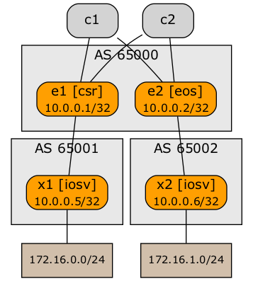
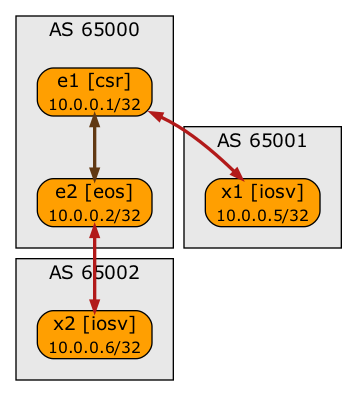

# Segment Routing with MPLS on Cisco CSR and Arista EOS

This lab topology builds a BGP-free core using SR-MPLS to transport data between PE-routers:

* X1 and X2 are external BGP routers
* E1 and E2 are PE-routers
* C1 and C2 are P-routers and are not running BGP

IGP routing and MPLS:

* IS-IS is run between E1, E2, C1 and C2. All four routers advertise their IPv4 SID with IS-IS
* SR-MPLS builds end-to-end paths across the AS 65000. These paths are then used to reach BGP next hops (E1 and E2).

To set up this lab:

* Copy topology.yml into an empty directory
* [Install netlab](https://netsim-tools.readthedocs.io/en/latest/install.html)
* [Install a virtualization environment](https://netsim-tools.readthedocs.io/en/latest/install.html#building-the-lab-environment) and vEOS and CSR VM images.
* Execute **netlab up**
